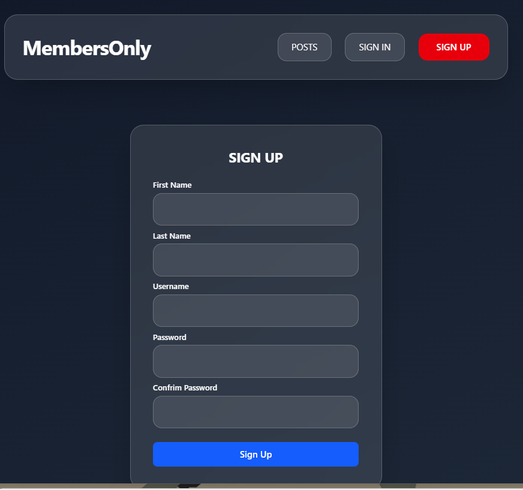
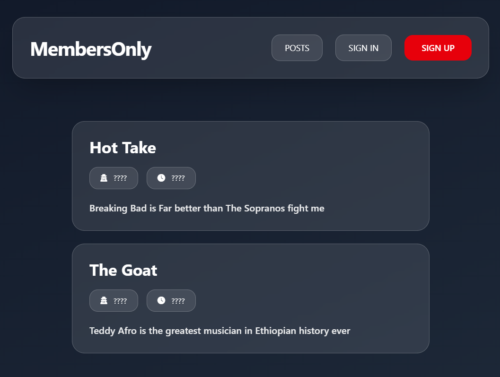
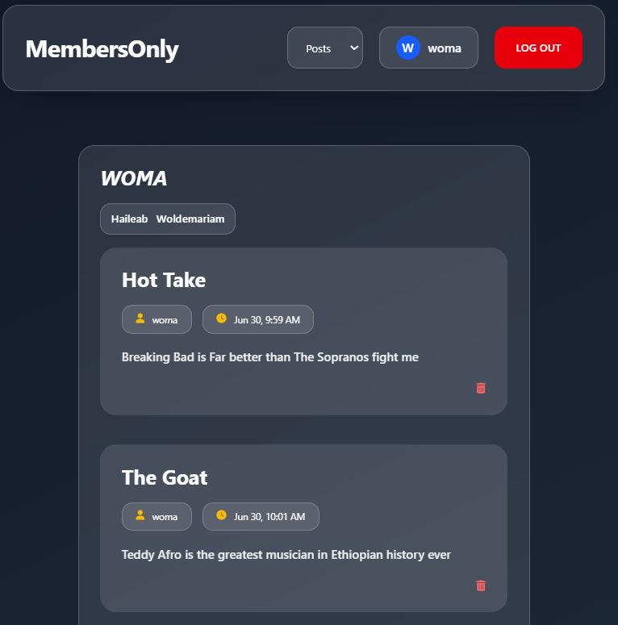
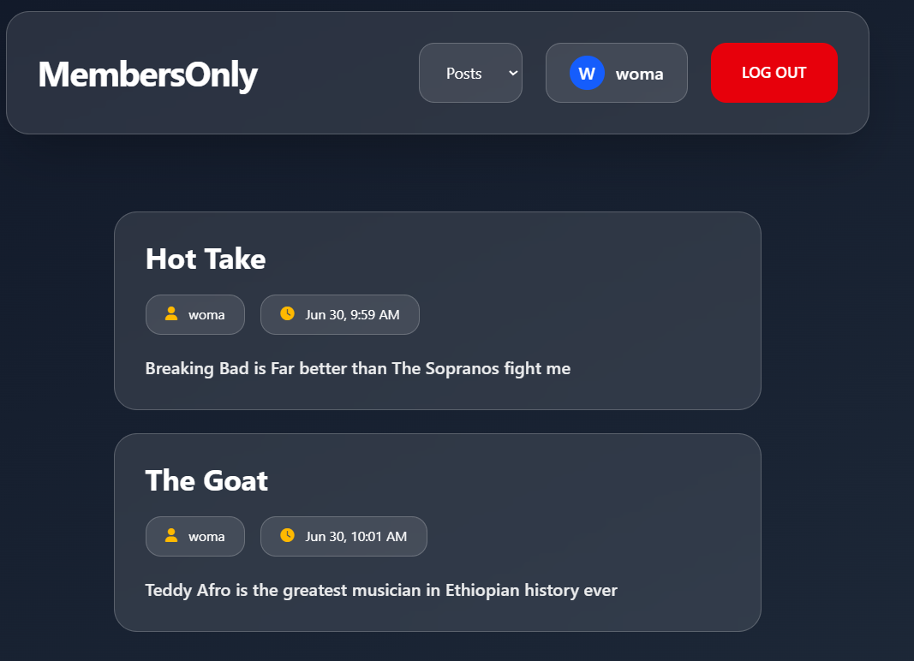

# 🔒 MembersOnly

A members-only message board built as part of [The Odin Project](https://www.theodinproject.com/) curriculum — anyone can see that a post exists, but you need to sign in to actually see who wrote it and when.

This was my first real dive into authentication. I used Passport.js for the login system and PostgreSQL with express-session to keep users logged in across requests. Getting sessions and cookies to actually click conceptually took a while, but once it did, the whole auth flow finally made sense.

---

## Screenshots

### Sign Up


### Posts — Logged Out
Author and timestamp are hidden until you sign in.


### Posts — Logged In
Once signed in you can see who posted what and when, plus delete your own posts.


### Posts — Wider View


---

## How It Works

- Anyone can visit the site and see that posts exist
- Logged out users see the post title and content, but the author and timestamp are hidden behind `????`
- Once you sign up and log in, every post reveals who wrote it and when
- You can only delete posts you created yourself
- Sessions are stored in PostgreSQL so you stay logged in across visits, not just for the current tab

---

## Tech Stack

- **Backend** — Node.js, Express
- **Authentication** — Passport.js (local strategy)
- **Database** — PostgreSQL
- **Session Store** — connect-pg-simple (sessions saved in Postgres, not memory)
- **Password Hashing** — bcryptjs
- **Validation** — express-validator
- **Templating** — EJS
- **Styling** — Tailwind CSS
- **Deployment** — Render + Neon

---

## Getting Started

### Prerequisites

- Node.js installed
- PostgreSQL installed and running

### Installation

1. Clone the repo
```bash
git clone https://github.com/HaileabWolde/MembersOnly_Odin.git
cd MembersOnly_Odin
```

2. Install dependencies
```bash
npm install
```

3. Create a `.env` file in the root directory
```env
DATABASE_URL=your_postgresql_connection_string
FOO_COOKIE_SECRET=your_session_secret
```

4. Set up the database — create your tables, including the session table required by connect-pg-simple
```sql
CREATE TABLE "user_sessions" (
  "sid" varchar NOT NULL COLLATE "default",
  "sess" json NOT NULL,
  "expire" timestamp(6) NOT NULL
);
ALTER TABLE "user_sessions" ADD CONSTRAINT "session_pkey" PRIMARY KEY ("sid");
```

5. Start the server
```bash
node app.js
```

6. Open your browser and go to `http://localhost:3000`

---

## What I Learned

This project was where sessions, cookies, and authentication actually clicked for me. I went down a rabbit hole understanding the difference between a cookie and a session, why `req.session` exists, where it comes from, and how Passport's `serializeUser` / `deserializeUser` automate what I was previously doing manually.

I also hit a handful of real bugs along the way — a typo in a folder name that took longer to find than it should have, an express-validator middleware I forgot to actually attach to the route so it silently did nothing, and a bcrypt crash from passing it an undefined password. Each one taught me to read error messages more carefully instead of skimming them.

---

## Live Demo

[MembersOnly on Render](https://your-app-name.onrender.com)

> Hosted on Render's free tier — may take 30-40 seconds to wake up on first load.

---

## Author

**Haileab** — building this on days off from working at Ethiopian Airlines.

- GitHub: [@HaileabWolde](https://github.com/HaileabWolde)